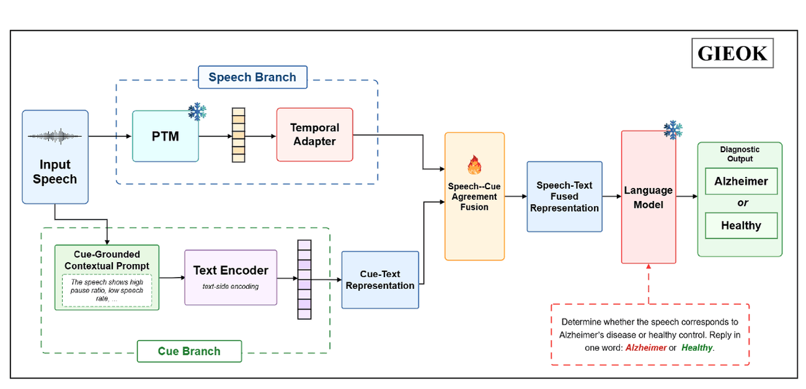

# LUMEN

**L**anguage **U**nderstanding and **M**ultimodal **E**vidence **N**etworks — research code accompanying my publications.

---

## GIEOK: A Paralinguistic Audio–Language Modeling for Zero-Shot Cross-Lingual Alzheimer's Detection

**Girish, Mohd Mujtaba Akhtar, Muskaan Singh, Juliana Gerard, Paula McClean, Kongfatt Wong-Lin**
*IEEE Signal Processing Letters, 2026 (accepted)*
Ulster University, UK · Corresponding author: Muskaan Singh (m.singh@ulster.ac.uk)

[](https://github.com/mohdmujtabaakhtar/LUMEN/actions/workflows/tests.yml)
[](LICENSE)


Speech is an early and inexpensive window on Alzheimer's disease (AD), but a detector trained on English usually falls apart on other languages. **GIEOK** detects AD in Chinese, Spanish and Greek **without any target-language adaptation**: it is trained on English speech only.

The idea is that clinical *cues* — pause behaviour, fluency, ASR confidence, prosody — carry real diagnostic evidence, but not equally in every recording. A pause pattern can reflect a language's speaking style rather than cognition, and low ASR confidence can mean an accent rather than impairment. GIEOK therefore never trusts cues blindly: **Speech–Cue Agreement Fusion (SCAF)** weights each cue by how reliable the cue stream looks for that utterance and by how well the individual cue agrees with the speech representation, keeping the fused representation speech-dominant.

<p align="center"></p>

## How it works

1. **Speech stream.** A frozen **TRILLsson** encoder gives frame-level paralinguistic features; a trainable temporal adapter maps them to **K speech tokens** `Z_s` instead of one pooled vector, so temporal and prosodic structure survives (Eq. 1).
2. **Cue stream.** Timing, fluency, ASR-confidence and acoustic-prosodic markers are measured automatically, discretised into **Low / Medium / High** using the 33rd and 66th percentiles **of the English training split only** (Eq. 2), verbalised with a fixed clinical template, encoded by the decoder's frozen text pathway and mapped by a cue adapter to **M cue tokens** `Z_c` (Eq. 3).
3. **SCAF** (Eqs. 4–6). Attention-pooled summaries of both streams give an utterance-level reliability `r` and a token-level agreement `a_m`:
   ```
   r     = σ(w_rᵀ [z̄_s ; z̄_c] + b_r)
   a_m   = σ(w_aᵀ [z̄_s ; z_c,m] + b_a)
   z̃_c,m = r · a_m · z_c,m,        U = CrossAttn(Z_s, Z̃_c)
   β     = σ(W_β [Z_s ; U] + b_β), Z_f = β ⊙ Z_s + (1 − β) ⊙ U
   ```
4. **Diagnostic generation.** `Z_f` is projected into continuous **prefix tokens** for a frozen **Qwen2.5-7B** decoder, followed by the fixed instruction *"Determine whether the speech corresponds to Alzheimer's disease or healthy control. Reply in one word: Alzheimer or Healthy."* Decoding is restricted to those two answers (Eq. 7).
5. **Training** (Eq. 8). The encoder and the decoder stay frozen; only the adapters, SCAF and the prefix projection are trained:
   ```
   L_total = L_LM + λ_rel · L_rel + λ_agree · L_agree
   ```
   `L_rel` keeps the reliability scores from collapsing, `L_agree` pulls matched speech and cue summaries together.

## Quick start

```bash
git clone https://github.com/mohdmujtabaakhtar/LUMEN.git
cd LUMEN
pip install -r requirements.txt

pytest                                          # unit tests, ~10 s on CPU

python -m gieok.train --synthetic               # full model (SCAF) on generated data, ~1 min on CPU
python -m gieok.train --synthetic --fusion crossattn   # cue prompt with cross-attention
python -m gieok.train --synthetic --fusion concat      # cue prompt with concatenation
python -m gieok.train --synthetic --fusion none        # no cue prompt (speech-only ALM)
python -m gieok.train --synthetic --model probe        # end-to-end speech baseline (no decoder)
python -m gieok.train --synthetic --set model.use_reliability=false    # SCAF ablations
python -m gieok.compare results/gieok-scaf.json results/gieok-concat.json   # McNemar's test
```

`--synthetic` writes a four-language stand-in corpus (English source, Chinese / Spanish / Greek zero-shot) and swaps Qwen2.5-7B for a tiny offline language model, so every path runs on a CPU without downloads or clinical data. That stand-in model has no pretrained knowledge to steer, so the smoke test also gives it LoRA adapters; paper runs keep the decoder frozen. The synthetic run checks that the pipeline works; it is **not** a reproduction of the paper's results, which need the real corpora.

## Running on the paper's corpora

**Corpora** (each from its custodian, under its own access terms). English is the only training language; the rest are zero-shot test sets.

| Language | Corpus | AD | HC |
|---|---|---|---|
| English (source) | Pitt / DementiaBank, Cookie Theft picture description | 309 | 243 |
| Spanish | Ivanova corpus (reading task) | 74 | 196 |
| Chinese | NCMMSC AD (picture description and fluency) | 79 | 108 |
| Greek | Dem@Care (DS3, DS5, DS7) | 115 | 58 |

English is split 80/20 speaker-independently for development; target-language data are used only for evaluation. The pipeline follows the manifest's `split` column, and if the English rows carry no `test` split it makes the 80/20 speaker-independent split itself.

**1. Extract frame-level speech features:**

```bash
python -m gieok.features --model trillsson --inputs en_wavs.txt --out-dir data/ad/features/en   # paper
python -m gieok.features --model whisper   --inputs en_wavs.txt --out-dir data/ad/features/en   # comparison
```

**2. Measure the clinical cues** (add `--asr` with a recogniser's word list to get the fluency and ASR-confidence cues):

```bash
python -m gieok.cues --inputs en_wavs.txt --asr en_asr.jsonl --out data/ad/cues_en.csv
```

The ASR file is JSON Lines, one record per utterance: `{"id": "S001", "words": [{"word": "the", "confidence": 0.93}, ...]}`.

**3. Write one manifest** for all languages, with columns `id, speaker_id, features, label, language, split` (label 1 = AD, `split` = `train` / `test`; every target-language row is `test`).

**4. Train and evaluate** (needs a GPU and access to `Qwen/Qwen2.5-7B`):

```bash
python -m gieok.train --manifest data/ad/manifest.csv --cues data/ad/cues.csv
```

Cue thresholds are fitted on the English training split, saved next to the report, and reused unchanged for every language. The report holds per-language accuracy, macro-F1, class-wise AD/HC scores and the per-utterance predictions used by `gieok.compare`.

## Published results

Results as reported in the paper (accuracy / macro-F1, %). Numbers from a rerun can vary slightly with feature extraction, data splits and random seeds. **Avg** is the average over the zero-shot languages Zh, Es and El. Whis = Whisper, Tril = TRILLsson, (A) = audio-language model, Qw2-A = Qwen2-Audio, Qw2.5-O = Qwen2.5-Omni.

**Cross-lingual performance (Table I):**

| Method | En | Zh | Es | El | Avg |
|---|---|---|---|---|---|
| *End-to-end* Whis | 70.67 / 68.29 | 34.81 / 33.44 | 36.18 / 34.76 | 40.52 / 39.09 | 37.17 / 35.76 |
| *End-to-end* Tril | 73.16 / 70.48 | 50.73 / 48.21 | 52.86 / 46.35 | 45.94 / 45.12 | 49.84 / 46.56 |
| *Fine-tuned ALM, no cue prompt* Qw2-A | 72.46 / 71.83 | 37.29 / 36.74 | 39.18 / 34.92 | 39.57 / 36.31 | 38.68 / 35.99 |
| *Fine-tuned ALM, no cue prompt* Qw2.5-O | 73.68 / 72.15 | 39.84 / 38.43 | 41.06 / 37.79 | 40.22 / 35.97 | 40.37 / 37.40 |
| *Fine-tuned ALM, cue prompt* Qw2-A | 75.83 / 73.06 | 60.47 / 58.92 | 71.14 / 69.68 | 72.31 / 69.79 | 67.97 / 66.13 |
| *Fine-tuned ALM, cue prompt* Qw2.5-O | 76.27 / 73.71 | 64.88 / 63.19 | 73.96 / 72.24 | 69.53 / 68.41 | 69.46 / 67.95 |
| GIEOK, no cue prompt, Whis (A) | 78.57 / 76.14 | 70.62 / 68.04 | 63.25 / 60.11 | 58.18 / 55.19 | 64.02 / 61.11 |
| GIEOK, no cue prompt, Tril (A) | 82.15 / 80.02 | 71.26 / 69.51 | 73.94 / 70.93 | 65.52 / 62.64 | 70.24 / 67.69 |
| GIEOK, cue prompt + concatenation, Whis (A) | 80.74 / 78.25 | 74.89 / 60.31 | 68.97 / 66.42 | 62.16 / 60.85 | 68.67 / 62.53 |
| GIEOK, cue prompt + concatenation, Tril (A) | 88.37 / 86.92 | 78.14 / 76.68 | 75.41 / 72.79 | 71.06 / 68.53 | 74.87 / 72.67 |
| GIEOK, SCAF, Whis (A) | 86.27 / 84.91 | 79.38 / 67.76 | 74.14 / 73.58 | 71.83 / 70.45 | 75.12 / 70.60 |
| **GIEOK, SCAF, Tril (A)** | **94.63 / 92.18** | **83.74 / 82.29** | **80.86 / 79.41** | **77.95 / 74.32** | **80.85 / 78.67** |

With the same TRILLsson backbone, SCAF improves over cue concatenation by 5.60 / 5.61 (Zh), 5.45 / 6.62 (Es) and 6.89 / 5.79 (El) accuracy / F1. McNemar's test on the pooled zero-shot predictions gives *p* < 0.05 against the strongest cue-concatenation baseline. For comparison, the ADReSS-M baseline reports 73.91 / 71.40 on En→El and Chen et al. report 69.57 / 72.00 in a related setting, against 77.95 / 74.32 for GIEOK.

**Class-wise scores of the final model (AD, then HC; accuracy / F1):** En 94.21 / 92.74 and 95.06 / 91.63; Zh 82.91 / 81.47 and 84.52 / 83.08; Es 79.84 / 78.36 and 81.77 / 80.42; El 76.38 / 73.11 and 79.43 / 75.56 — the gains are not concentrated in one diagnostic class.

**Ablation of SCAF (Table II):**

| Variant | En | Avg (Zh, Es, El) | Command |
|---|---|---|---|
| Cue prompt with cross-attention | 90.22 / 88.97 | 74.14 / 71.08 | `--fusion crossattn` |
| SCAF w/o reliability | 91.70 / 89.12 | 78.59 / 76.77 | `--set model.use_reliability=false` |
| SCAF w/o token agreement | 89.00 / 86.18 | 71.31 / 69.76 | `--set model.use_agreement=false` |
| SCAF w/o gated fusion | 92.42 / 91.00 | 78.66 / 77.07 | `--set model.use_gate=false` |
| SCAF w/o agreement loss | 88.90 / 87.16 | 76.66 / 73.28 | `--set model.lambda_agree=0` |
| **GIEOK** | **94.63 / 92.18** | **80.85 / 78.67** | *(default)* |

Removing token-level agreement costs the most, and every component contributes.

## Implementation notes

| Component | Setting |
|---|---|
| Speech encoder | Frozen TRILLsson (1024-d) or Whisper-base encoder (512-d), features pre-extracted; TRILLsson is run on overlapping 2 s windows (1 s hop) so the utterance keeps a token sequence |
| Temporal adapter | Two Conv1d layers (kernel 3) + adaptive pooling to K = 16 tokens + layer norm |
| Cue adapter | Two linear layers on the text-pathway hidden states + adaptive pooling to M = 8 cue tokens |
| Cue measurement | 12 markers in four groups; the exact marker list is in [`gieok/cues.py`](gieok/cues.py) (the paper names the groups, not the individual features) |
| Cue thresholds | 33rd / 66th percentiles from the English training split, stored in `*_cue_thresholds.json` and reused for all languages |
| Cue prompts | Verbalised from the three-level descriptors, so utterances share prompts; each distinct prompt is encoded once by the frozen text pathway. A cue that was not measured is left out, and the cue adapter pools over a prompt's real tokens only |
| SCAF | `r` and `a_m` from attention-pooled summaries; cross-attention with 4 heads; residual gate |
| `L_rel` | `(mean(r) − 0.5)² + relu(0.01 − var(r))`: keeps reliability from collapsing to a constant (the paper states the purpose, not the form) |
| `L_agree` | Symmetric InfoNCE over the batch (temperature 0.07): matched speech / cue summaries closer than mismatched ones |
| Prefix | `Z_f` pooled to K_p = 8 tokens and projected into the decoder's embedding space |
| Answer scoring | Mean per-token log-likelihood of "Healthy" and "Alzheimer" given the prefix and the instruction - the same quantity `L_LM` minimises, so the two answers stay comparable whatever their token length |
| Training | AdamW, lr 1e-4, weight decay 1e-2, batch 8, 50 epochs (paper); gradient clipping at 1.0 |
| Not fixed by the paper | d, K, M, K_p, λ_rel, λ_agree and the number of attention heads are configuration values here ([`gieok/configs/gieok.yaml`](gieok/configs/gieok.yaml)) |

## Files

| File | Contents |
|---|---|
| [`gieok/cues.py`](gieok/cues.py) | Cue measurement, percentile discretisation, clinical-evidence template, CLI |
| [`gieok/features.py`](gieok/features.py) | Frozen TRILLsson / Whisper frame-level feature extraction, CLI |
| [`gieok/modules.py`](gieok/modules.py) | Temporal and cue adapters, attention pooling, SCAF, `L_rel` and `L_agree` |
| [`gieok/model.py`](gieok/model.py) | GIEOK, the fusion variants and the end-to-end speech probe |
| [`gieok/alm.py`](gieok/alm.py) | Frozen decoder: text pathway for cue prompts, prefix conditioning, constrained answers, LoRA |
| [`gieok/data.py`](gieok/data.py) | Manifests, cue prompts, cue bank, speaker-independent splits, synthetic corpus |
| [`gieok/train.py`](gieok/train.py) | Training on the source language and zero-shot evaluation |
| [`gieok/compare.py`](gieok/compare.py) | McNemar's test between two runs |
| [`gieok/metrics.py`](gieok/metrics.py) | Accuracy, macro-F1, class-wise scores, McNemar |
| [`gieok/configs/gieok.yaml`](gieok/configs/gieok.yaml) | Hyperparameters, with paper values marked |

## Citation

```bibtex
@article{girish2026gieok,
  title   = {A Paralinguistic Audio--Language Modeling for Zero-Shot Cross-Lingual Alzheimer's Detection},
  author  = {Girish and Akhtar, Mohd Mujtaba and Singh, Muskaan and Gerard, Juliana and McClean, Paula and Wong-Lin, KongFatt},
  journal = {IEEE Signal Processing Letters},
  year    = {2026}
}
```

## Funding

Supported by the SPEECH-D project funded through the Alzheimer's Research UK Research Network, the United States–Ireland–Northern Ireland R&D Partnership Programme (USI-207), and NI-HPC under EPSRC Grant EP/T022175/1.

## Ethics

GIEOK is a research prototype for screening research, not a diagnostic tool. The clinical corpora stay with their custodians under their own consent and access conditions, and none of them is distributed here. Any clinical use would need prospective validation and clinician oversight.

## License

Code is released under the [MIT License](LICENSE). The datasets keep their own licences and access conditions.
